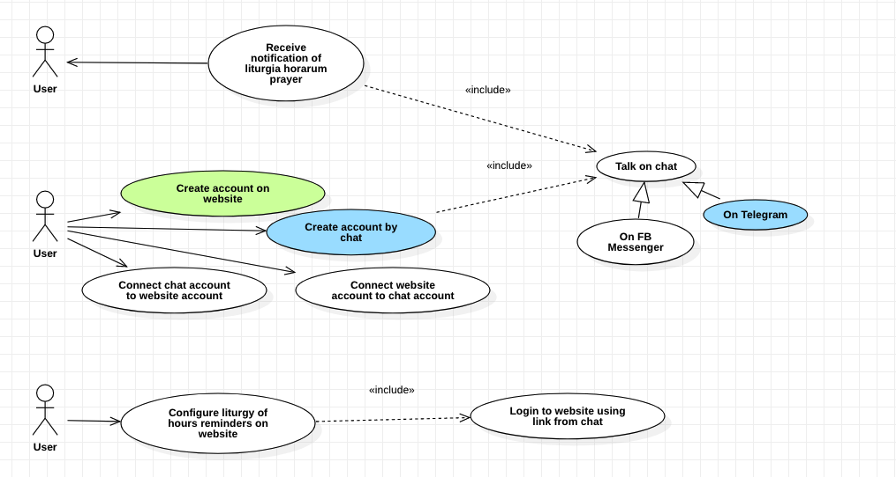

# prioratus

Prioratus app: living in the rhythm of the Liturgy of the Hours to achieve peace of mind

- [Architecture considerations: 3factor app (3FA) vs domain-driven-development (DDD)](./3fa-vs-ddd.md)

## Use cases

