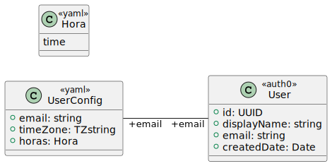

# prioratus

Prioratus app: living in the rhythm of the Liturgy of the Hours to achieve peace of mind

## Use cases

1. Breviary prayers beta
  1. - [x] Only users listed in config.yml can see the UI
  1. - [ ] Prayer hours for beta users are configured through config.yml
  1. - [ ] User timezone is configured through config.yml server sends hours using GMT ()= ISO+Z) time
  1. - [ ] User clicks 'Pray' and breviary prayer is opened through browser sub-window
  1. - [ ] Notification with link to active prayer is sent through Github issue comment
  1. - [ ] When Hora starts it is registered in the database
  1. - [ ] When user clicks 'Pray' it is recorded that he started praying
  1. - [ ] When user exits the Prayer tab question is asked whether he finished praying
  1. - [ ] When next Hora starts and prayer is not finished it is recorded that prayer was not picked up
  1. - [ ] After user has prayed the link becomes inactive

## Use cases (old)

## Domain model

## Considerations (old)

- [Architecture considerations: 3factor app (3FA) vs domain-driven-development (DDD)](./3fa-vs-ddd.md)